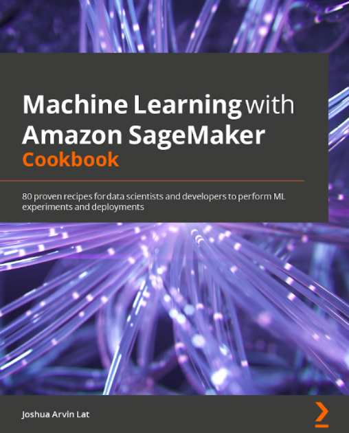

# [Machine Learning with Amazon SageMaker Cookbook: 80 proven recipes for data scientists and developers to perform ML experiments and deployments](https://www.amazon.com/Machine-Learning-Amazon-SageMaker-Cookbook/dp/1800567030) 

This is the official code repository for [Machine Learning with Amazon SageMaker Cookbook: 80 proven recipes for data scientists and developers to perform ML experiments and deployments](https://www.amazon.com/Machine-Learning-Amazon-SageMaker-Cookbook/dp/1800567030), published by [Packt](https://www.packtpub.com/?utm_source=github). This repository contains most of the notebooks and supporting files to help the readers work through each of the recipes of this book. 

## Book Description

**Amazon SageMaker** is a fully managed machine learning (ML) service that aims to help data scientists and ML practitioners manage ML experiments. In this book, you will use the different capabilities and features of Amazon SageMaker to solve relevant data science and ML requirements.

This step-by-step guide has `80 proven recipes` designed to give you the hands-on experience needed to contribute to real-world ML experiments and projects. The book covers different algorithms and techniques when training and deploying NLP, time series forecasting, and computer vision models to solve various ML problems. You will explore various solutions when working with deep learning libraries and frameworks such as **TensorFlow**, **PyTorch**, and **Hugging Face Transformers** in Amazon SageMaker. In addition to these, you will learn how to use **SageMaker Clarify**, **SageMaker Model Monitor**, **SageMaker Debugger**, and **SageMaker Experiments** to debug, manage, and monitor multiple ML experiments and deployments. You will also have a better understanding of how **SageMaker Feature Store**, **SageMaker Autopilot**, and **SageMaker Pipelines** can solve the different needs of data science teams.

By the end of this book, you will be able to combine the different solutions you have learned as building blocks to solve real-world ML requirements.

## Author

**Joshua Arvin Lat** is the **Chief Technology Officer** (CTO) of NuWorks Interactive Labs, Inc. He previously served as the CTO of 3 Australian-owned companies and also served as the Director for Software Development and Engineering for multiple e-commerce startups in the past which allowed him to be more effective as a leader. Years ago, he and his team won 1st place in a global cybersecurity competition with their published research paper. He is also an **AWS Machine Learning Hero** and he has been sharing his knowledge in several international conferences to discuss practical strategies on machine learning, engineering, security, and management.

He holds 9 AWS certifications and has contributed several times as a certification **Subject Matter Expert** (SME) to help update the **AWS Certified Machine Learning - Specialty** (ML - S) exam during the Item Development Workshops.

## [Book Chapters](https://www.amazon.com/Machine-Learning-Amazon-SageMaker-Cookbook/dp/1800567030) 

### [Chapter 1 - Getting Started with Machine Learning using Amazon SageMaker](Chapter01)

- Launching an Amazon SageMaker Notebook Instance
- Checking the versions of the SageMaker Python SDK and the AWS CLI
- Preparing the Amazon S3 Bucket and the Training Dataset for the Linear Regression Experiment
- Visualizing and Understanding your Data in Python
- Training your First Model in Python
- Loading a Linear Learner Model with Apache MXNet in Python
- Evaluating the Model in Python
- Deploying your First Model in Python
- Invoking an Amazon SageMaker Model Endpoint with the SageMakerRuntime Client from boto3

### [Chapter 2 - Building and Using your own Algorithm Container Image](Chapter02)

- Launching and Preparing the Cloud9 Environment
- Setting up the Python and R Experimentation Environments
- Preparing and Testing the “train” Script in Python
- Preparing and Testing the “serve” Script in Python
- Building and Testing the Custom Python Algorithm Container Image
- Pushing the Custom Python Algorithm Container Image to an Amazon ECR Repository
- Using the Custom Python Algorithm Container Image for Training & Inference with Amazon SageMaker Local Mode
- Preparing and Testing the “train” Script in R
- Preparing and Testing the “serve” Script in R
- Building and Testing the Custom R Algorithm Container Image
- Pushing the Custom R Algorithm Container Image to an Amazon ECR Repository
- Using the Custom R Algorithm Container Image for Training & Inference with Amazon SageMaker Local Mode

### [Chapter 3 - Using Machine Learning and Deep Learning Frameworks with SageMaker](Chapter03)

- Preparing the SageMaker Notebook Instance for Multiple Deep Learning Local Experiments
- Generating a Synthetic Dataset for Deep Learning Experiments
- Preparing the entrypoint TensorFlow and Keras training script
- Training and Deploying a Tensorflow and Keras model with Amazon SageMaker Local Mode
- Preparing the entrypoint PyTorch training script
- Preparing the entrypoint PyTorch inference script
- Training and Deploying a PyTorch model with Amazon SageMaker Local Mode
- Preparing the entrypoint Scikit-learn training script
- Training and Deploying a Scikit-learn model with Amazon SageMaker Local Mode
- Debugging Disk Space issues when using Local Mode
- Debugging Container Execution Issues when using Local Mode

### [Chapter 4 - Preparing, Processing, and Analyzing the Data](Chapter04)

- Generating a Synthetic Dataset for Anomaly Detection Experiments
- Training and Deploying a Random Cut Forest Model
- Invoking Machine Learning Models with Amazon Athena using SQL queries
- Analyzing Data with Amazon Athena in Python
- Generating a Synthetic Dataset for Analysis and Transformation
- Performing Dimensionality Reduction with the built-in PCA Algorithm
- Performing Cluster Analysis with the built-in KMeans Algorithm
- Converting CSV data into protobuf recordIO format
- Training a KNN model using the protobuf recordIO training input type
- Preparing the SageMaker Processing Prerequisites using the AWS CLI
- Managed Data Processing with SageMaker Processing in Python
- Managed Data Processing with SageMaker Processing in R

### [Chapter 5 - Effectively Managing Machine Learning Experiments](Chapter05)

- Synthetic Data Generation for Classification Problems
- Identifying Issues with SageMaker Debugger
- Inspecting SageMaker Debugger Logs and Results
- Running and Managing Multiple Experiments with SageMaker Experiments
- Experiment Analytics with SageMaker Experiments
- Inspecting Experiments, Trials, and Trial Components with SageMaker Experiments

### [Chapter 6 - Automated Machine Learning in Amazon SageMaker](Chapter06)

- Onboarding to SageMaker Studio
- Generating a Synthetic Dataset with Additional Columns containing Random Values
- Creating and Monitoring a SageMaker Autopilot Experiment in SageMaker Studio (Console)
- Creating and Monitoring a SageMaker Autopilot Experiment using the SageMaker Python SDK
- Performing Automatic Model Tuning with the SageMaker XGBoost Built-in Algorithm
- Analyzing the Automated Model Tuning Job Results

### [Chapter 7 - Working with SageMaker Feature Store, SageMaker Clarify, and SageMaker Model Monitor](Chapter07)

- Generating a synthetic dataset and using the SageMaker Feature Store for storage and management
- Querying data from the offline store of SageMaker Feature Store and uploading it to Amazon S3
- Detecting pre-training bias with SageMaker Clarify
- Detecting post-training bias with SageMaker Clarify
- Enabling ML explainability with SageMaker Clarify
- Deploying an endpoint from a model and enabling data capture with SageMaker Model Monitor
- Baselining and scheduled monitoring with SageMaker Model Monitor

### [Chapter 8 - Solving NLP, Image Classification, and Time-Series Forecasting Problems with Built-in Algorithms](Chapter08)

- Generating a Synthetic Dataset for Text Classification Problems
- Preparing the Test Dataset for Batch Transform Inference Jobs
- Training and Deploying a BlazingText model
- Using Batch Transform for Inference
- Preparing the Datasets for Image Classification using the Apache MXNet Vision Datasets Functions
- Training & Deploying an Image Classifier using the Built-in Image Classification Algorithm in SageMaker
- Generating a Synthetic Time Series Dataset
- Performing the Train-Test Split on a Time Series Dataset
- Training and Deploying a DeepAR Model
- Performing Probabilistic Forecasting with a Deployed DeepAR Model

### [Chapter 9 - Managing Machine Learning Workflows and Deployments](Chapter09)

- Working with Hugging Face models
- Preparing the prerequisites of a multi-model endpoint deployment
- Hosting multiple models with multi-model endpoints
- Setting up AB testing on multiple models with production variants
- Preparing the Step Functions Execution Role
- Managing ML workflows with AWS Step Functions and the Data Science SDK
- Managing ML workflows with SageMaker Pipelines